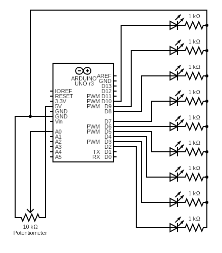

# Pot LED 
Just having fun with potentiometer and some LEDs.

## Hardware Required:
* Arduino UNO R3
* Breadboard
* Jumper Wire
* LEDs (I use 8 LEDs with 3 colors)
* 1k ohm resistor 1pcs (I also use 8 pcs)
* 10k ohm potentiometer

## Wiring Scheme

https://github.com/sayapakailinuxpak/PotLED/assets/55786451/1b345295-b0cf-47f2-ac94-8b9722a4b642

